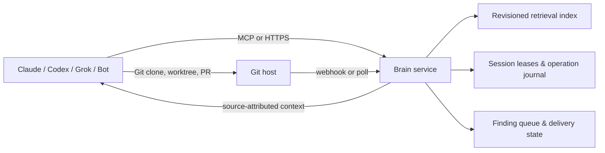

# Central Brain Service — future work specification

## Problem

The portable plugin keeps knowledge in Git-backed vaults and isolates active writers in local worktrees. This works well for individual agents and small teams, but it leaves several operations dependent on a machine with a checkout: vault discovery, cross-host session visibility, trusted retrieval, graph-refresh coordination, and tracker delivery.

The service should make those shared operations available to Claude Code, Codex, Grok Build, Grok Bot, and future agent hosts without becoming a second source of truth for the vault.

## Goal

Provide a hosted, tenant-isolated coordination and retrieval service for Git-backed Brain vaults. Git remains canonical for trusted notes, logs, graph artifacts, and reviewed changes. The service stores derived indexes, short-lived leases, operation records, and delivery state.

It exposes a versioned MCP interface and a small HTTP API so every host can use the same capability without adopting one vendor's plugin format.

## Non-goals

- Replace Git, pull requests, or vault governance.
- Write trusted notes directly to the default branch.
- Store raw agent reasoning, credentials, or private transcripts by default.
- Require a proprietary model, embedding provider, or hosted graph engine.
- Run arbitrary shell commands received through MCP.

## Primary workflows

1. A project binds to a vault by canonical Git remote. The service resolves policy and the latest indexed revision, while each host keeps its own checkout.
2. An agent opens a named session. The service grants a time-bounded lease for a logical target such as `wiki/hot.md`, reports collisions, and records the agent/host/version for audit.
3. An agent requests task context. The service returns a budgeted, ranked set of source-attributed notes, logs, and graph paths at a named commit, with draft/stale/trusted state preserved.
4. A host reports a completed graph build. The service validates source revision, scope, extractor version, and artifact digest before indexing it.
5. A session pushes a branch. The service records the candidate revision, links a PR when present, and only indexes it as trusted after the configured merge/review policy is satisfied.
6. A deterministic finding is queued once with an idempotency key and is routed to Linear/Jira only through an explicit vault policy.

## Architecture

The service indexes immutable Git revisions. A result always includes the vault remote, commit SHA, source path, trust state, and freshness information. The host must fetch or inspect that revision before treating a result as current source evidence.

## API / MCP surface

| Tool | Purpose | Write boundary |
|---|---|---|
| `vault.resolve` | Resolve canonical remote, policy, and indexed head | Read-only |
| `context.search` | Retrieve budgeted, attributed context at a revision | Read-only |
| `session.acquire` | Acquire a lease for a logical resource | Lease only |
| `session.heartbeat` | Renew a valid lease | Lease only |
| `session.release` | End a lease | Lease only |
| `graph.report` | Register verified build provenance and artifact locations | Derived metadata only |
| `operation.record` | Idempotently record save/graph/publish state | Journal only |
| `finding.enqueue` | Queue a structured deterministic finding | Queue only |
| `finding.deliver` | Create/update a tracker issue using vault policy | External write; explicit tool allowlist |

Every write takes an idempotency key, vault ID, actor identity, expected vault revision where relevant, and a structured schema. The service rejects unknown fields and never executes free-form commands.

## Data model

| Record | Key fields | Retention |
|---|---|---|
| Vault | canonical remote, policy, default branch, tenant | Lifetime of registration |
| Revision | vault, SHA, parent SHA, indexed state | Retain while source revision is retained |
| Context document | revision, path, trust, provenance, chunk digest | Rebuildable derived data |
| Lease | vault, resource, session, expiry, actor | Short-lived; audit summary retained |
| Operation | idempotency key, revision, outcome, artifact digests | Auditable retention window |
| Finding | normalized fingerprint, status, tracker link | Policy-controlled |

Raw chats are excluded. If later enabled, they need a separate vault opt-in, encryption boundary, retention policy, and access-control review.

## Security and tenancy

- Authenticate users and service agents with short-lived, tenant-scoped credentials.
- Authorize every request against the vault policy and requested Git remote; never trust a caller-provided filesystem path.
- Use Git provider app/service credentials with least-privilege read access by default. Branch push or PR creation is a separately granted capability.
- Encrypt data in transit and at rest. Redact credentials from URLs, logs, errors, and traces.
- Keep private, team, and public vault indexes logically isolated. Tenant-scoped retrieval must not infer another tenant's vault names or graph vocabulary.
- Emit audit records for lease acquisition, retrieval of non-public vaults, operation reports, and tracker delivery.
- Apply rate limits, payload limits, schema validation, replay protection, and webhook signature verification.

## Consistency model

- Git revision is the source-of-truth version. Retrieval is read-your-revision, not necessarily read-latest.
- A lease prevents concurrent service-coordinated writes to one logical resource; it cannot prevent manual Git edits. Local compare-and-swap guards remain mandatory.
- A graph index is fresh only when its recorded source revision, scope fingerprint, ignore-file digest, graph artifact digest, and extractor version match.
- Trusted context is indexed from default-branch/review-approved revisions only. Candidate-branch context may be returned only when explicitly requested and labeled untrusted.
- Tracker delivery is at-least-once with idempotency keys; tickets and comments must contain the stable finding fingerprint.

## Rollout plan

1. Read-only remote registry and revision-aware retrieval, shadowing local `brain context` results.
2. Leases and operation journal, still with local Git worktrees and commit guards.
3. Graph provenance ingestion and stale-build reporting.
4. Finding routing to Linear/Jira with a dry-run mode and explicit policy.
5. Optional hosted graph/query workers only after cost, privacy, and extraction-quality evaluation.

## Acceptance criteria

- A Codex session and a Grok Bot session resolve the same GitHub vault URL to the same vault ID while using different local checkout paths.
- Context results identify exact revision and source path; a stale or draft result is visibly labeled.
- Two sessions contending for `wiki/hot.md` receive a deterministic lease result, while local CAS still rejects an out-of-band change.
- Repeating any write request with the same idempotency key returns the original outcome and does not create another tracker item.
- A malicious URL with embedded credentials, an unknown tenant, a cross-tenant context request, an expired lease, and an invalid Git webhook are all rejected and audited.
- Git outage does not permit stale data to be presented as current; it returns a labeled cached revision.

## Open decisions

- Hosting model: managed SaaS, self-hosted service, or both.
- Identity: GitHub App, OIDC workload identity, or enterprise SSO first.
- Indexing engine: Postgres full-text plus graph artifacts initially, or a dedicated graph/vector store once measured need exists.
- Retention and egress policy for private graph artifacts.
- Whether hosted workers may perform semantic extraction, and which customer-controlled model/provider credentials govern that work.
- Linear/Jira ownership and routing policy for shared-vault findings.

## Suggested Linear issue

Title: `Design central Brain coordination and retrieval service`

Description: Implement the phased service described here, beginning with read-only vault resolution and revision-aware context retrieval. Preserve Git as canonical, make every cross-host operation revisioned and source-attributed, and add writes only behind leases, idempotency, and explicit vault policy.

Labels: `brain`, `architecture`, `multi-agent`, `future`

Priority: High after agent-agnostic plugin validation is complete.
